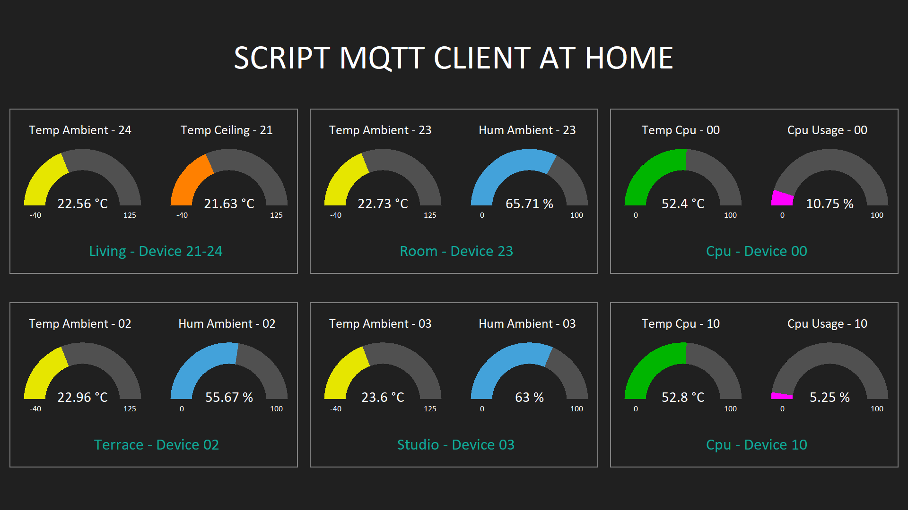

# Medialon manager script for MQTT client.

Note that this does not support the full MQTT spec but is intended to support enough for QoS 0 and 1 publishing.

## Enjoy !!

#### v1.0.1 - Malformed received messages could crash the script. Small improvement to avoid it.

#### v1.0.2 - keepalive var was bad initialized on default.Update the ping routine.

#### v1.0.3 - ClientId string is checked as only characters

##### 
##### Medialon Manager Panel screenshot:

